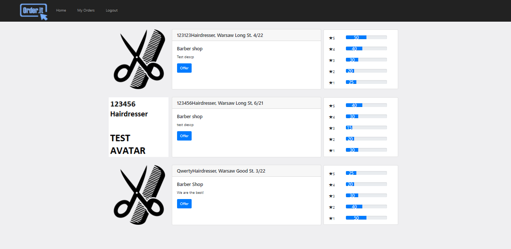
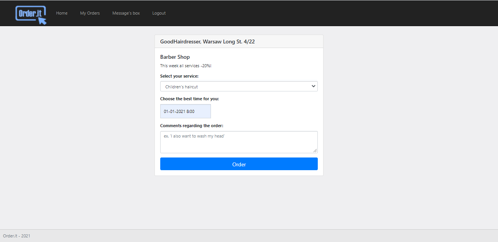

# pl.orderit
Web application for ordering service without having to contact the service provider.

## Table of contents
* [Technologies](#technologies)
* [Screenshots](#screenshots)
* [Features](#features)
* [Specified description](#Specified-description)
* [Author](#author)

## Technologies
* Java
* Spring framework (Spring Boot 2, Spring MVC, Spring Security, Spring Data JPA)
* Hibernate
* MySQL DB
* Maven
* Project Lombok
* JUnit, Mockito
* HTML
* Thymeleaf
* Bootstrap

## Screenshots
Home - landing page.

   
Registration - for users and shop owners.

   
Login - login page for users.

   
Offer - displays current offers of the services by city and shop type.

   
Order - allows user to order selected service.

   
Orders - displays previous orders, allows the user to write message to the shop's owner.

   
Manage - displays managment panel for shop owner.

   

## Features
* login, registration for users and shops
* find interesting shops in selected area
* create a new order
* write a message and comments regarding the order
* manage order as user or shop owner

## Specified description

The project is created using the Spring Boot 2 module from the Spring framework. The applications runs on the Tomcat server.
The frontend of the application is bassed on HTML documents using Bootstrap and Thymeleaf engine. It allows a client to interact with the backend part of the service. The user performs operations on the page, passes the data to rest controllers wich perform CRUD operations via services used for the business logic.
Backend layer interacts with the MySQL relational database using Spring Data JPA interfaces.
It uses the Hibernate framework to create and update database schemas. Spring Security is responsible for the security, session maintenance and encapsulation of the endpoints.
The source code contains implementation of basic unit and integration tests created with JUnit5 library using Mockito.

## Author
Michał Janiec
